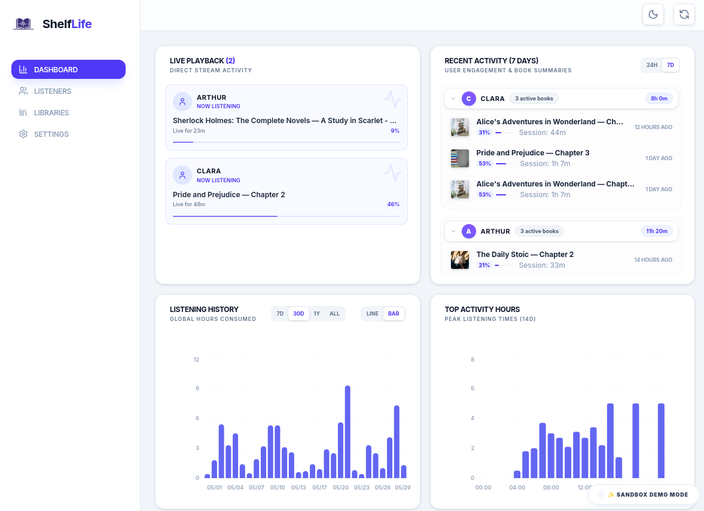
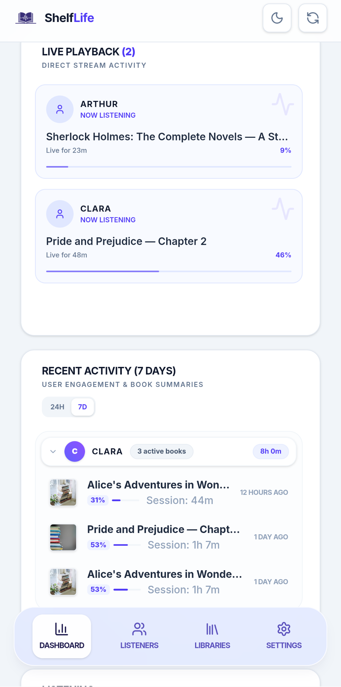

# 📚 ShelfLife

<div align="center">
  <p><strong>A feature-rich companion dashboard for Audiobookshelf.</strong></p>
  
  <p>
    
    
    
    
    
    
  </p>
  
  <p align="center">
    <a href="#-key-features">Key Features</a> •
    <a href="#️-quick-start-local-run">Quick Start (Local)</a> •
    <a href="#-docker-deployment">Docker Deployment</a> •
    <a href="#-mobile-deployment-android-native">Mobile Deployment</a> •
    <a href="#-security-considerations">Security Considerations</a>
  </p>
</div>

---

**ShelfLife** is a companion dashboard and mobile app designed for [Audiobookshelf](https://www.audiobookshelf.org/), a self-hosted audiobook and podcast server. 

ShelfLife delivers real-time listening logs, advanced stats, library audits, ASIN matching tools, and deep active-session tracking. Think of Tautulli for Audiobookshelf.

<details>
  <summary><strong>📸 Click to view Dashboard Previews</strong></summary>
  <br />
  
  <h4>🖥️ Desktop Dashboard</h4>
  
  
  <h4>📱 Mobile Dashboard</h4>
  
  
  <h4>🔗 Other Screenshots</h4>
  <ul>
    <li><strong>Library Auditing:</strong> <a href="assets/screenshots/desktop-library.png">Desktop View</a> | <a href="assets/screenshots/mobile-library.png">Mobile View</a></li>
    <li><strong>Listener & Active Sessions:</strong> <a href="assets/screenshots/desktop-user.png">Desktop View</a> | <a href="assets/screenshots/mobile-users.png">Mobile View</a></li>
  </ul>
</details>

## 🌟 Key Features

*   📊 **Real-Time Listener Dashboard**: Monitor system-wide listening statistics, server status, library sizes, and active listener sessions at a glance.
*   📈 **Deep Listener Analytics**: Visualize patterns with GitHub-style activity heatmaps, daily listening averages, completion rates, top genres, and device usage logs.
*   📚 **Interactive Library Audits**: Search and inspect your audiobooks across different libraries with responsive cover previews, duration info, and detail modals showing listening history and chapter listings.
*   🔍 **Audnex Book Matching**: Integrated ASIN (Audible) lookups that fetch metadata, descriptions, and chapters automatically to help you clean up and match your library's books.
*   📱 **Native Android Integration**: Built with Capacitor.


## ⚙️ Quick Start (Local Run)

### Prerequisites

*   [Node.js](https://nodejs.org/) (v18 or higher recommended)
*   An active [Audiobookshelf](https://www.audiobookshelf.org/) server instance


### Step 1: Install Dependencies

Clone this repository to your system and install the required packages:

```bash
npm install
```

### Step 2: Configure Environment Variables

Create a `.env` file in the root of the project using the template provided in `.env.example`:

```bash
cp .env.example .env
```

Open the `.env` file and configure it with your Audiobookshelf server details:

```ini
# Port where the ShelfLife server will run (default is 3000)
PORT=3000

# The URL of your Audiobookshelf instance
ABS_URL="https://audiobookshelf.example.com"

# Your Audiobookshelf API Token (admin dashboard or user token)
ABS_TOKEN="your_private_api_token"

# Optional: Custom headers in JSON format (e.g. for Cloudflare Access bypass)
# ABS_EXTRA_HEADERS='{"CF-Access-Client-Id": "xyz", "CF-Access-Client-Secret": "abc"}'
```

### Step 3: Run the Development Server

Start both the backend proxy and the Vite development server simultaneously:

```bash
npm run dev
```

Visit the app in your browser at `http://localhost:3000`.

### Step 4: Build for Production

Compile the optimized static frontend bundle:

```bash
npm run build
```

To host ShelfLife in production, run:

```bash
npm run start
```

---

## 🐳 Docker Deployment

ShelfLife is fully containerized and can be easily deployed using Docker or Docker Compose. This is the recommended method for hosting ShelfLife on a home server or NAS.

### Option 1: Docker Compose (Recommended)

You can configure your environment variables in one of two ways:
*   **Via `.env` file (Recommended):** Create a `.env` file in the same directory as `docker-compose.yml` and populate it (see [Configure Environment Variables](#️-configure-environment-variables)). Docker Compose will automatically read it.
*   **Directly in `docker-compose.yml`:** Open `docker-compose.yml` and replace the `${VARIABLE}` placeholders with your actual values under the `environment:` block (e.g., `ABS_URL=https://audiobookshelf.example.com`).

Once configured, run:

1. Start the container in detached mode:
   ```bash
   docker compose up -d
   ```
2. The dashboard will be accessible at `http://localhost:3000` (or your configured `PORT`).

### Option 2: Docker CLI

1. Build the production Docker image locally:
   ```bash
   docker build -t shelflife .
   ```
2. Start the container, loading your environmental configuration:
   ```bash
   docker run -d \
     -p 3000:3000 \
     --env-file .env \
     --name shelflife \
     --restart unless-stopped \
     shelflife
   ```

---

## 📱 Mobile Deployment (Android Native)

ShelfLife includes native mobile support via Capacitor.

### Build and Install Automatically (via Bash Script)

If you have an Android device or emulator connected via USB and `adb` installed in your path, run the automated compile-and-install script:

```bash
chmod +x build-android.sh
./build-android.sh
```

---

### Compile Manually

If you prefer to compile manually, follow these steps:

1.  **Build the static assets**:
    ```bash
    npm run build
    ```
2.  **Sync the code to your native Capacitor Android project**:
    ```bash
    npx cap sync android
    ```
3.  **Compile and launch**:
    Open the `/android` folder in **Android Studio** to run, debug, or build a signed release APK of the app.

---

## 🔒 Security Considerations

> [!WARNING]
> **Best Practices for Secure Deployment:**
> ShelfLife does not implement its own user authentication or management. To secure your setup against critical proxy risks—including open-proxy SSRF scans, unencrypted HTTP credential exposure, browser local storage leaks, and environmental token escalation:
> 
> 1. **Deploy behind an Authentication Layer**: Always place the ShelfLife web server behind a secure reverse proxy (e.g., Caddy, Nginx, or a Cloudflare Tunnel) that terminates TLS/HTTPS and enforces access control (such as Basic Auth, Authelia, or Cloudflare Access).
> 2. **Limit Network Access**: Alternatively, restrict hosting to a private local network (LAN) or access the dashboard remotely via a secure VPN (WireGuard, Tailscale).
> 3. **Use Environment Variables**: For standard deployments, configure `ABS_URL` and `ABS_TOKEN` directly in your server's `.env` file. This prevents credentials from being stored in the browser's `localStorage` or transmitted during client logins.
> 
> *For Android users, native Capacitor capabilities allow the mobile app to connect directly to your ABS server, bypassing the web gateway completely.*

